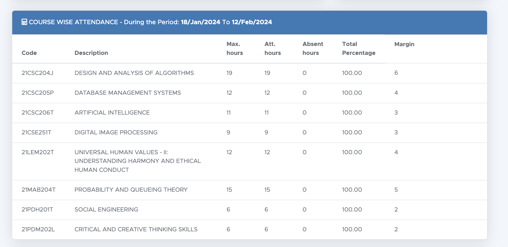
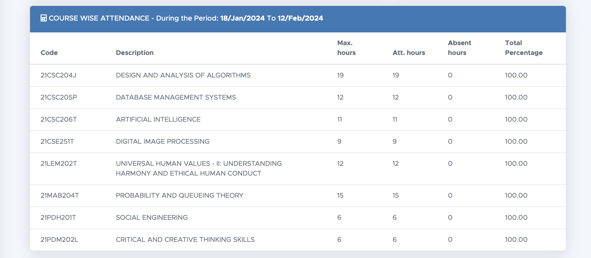

# SRM-Margin-Check

This is a chrome extension to make Academia and student portal more tolerable by adding a margin column in the attendance table and giving total marks and showing the subject name in the marks table.

## Steps to install extension

1. Download the latest [SRM-Academia-Extended.zip](https://github.com/SukhOberoi/SRM-Academia-Extended/releases/tag/Final) from releases.
2. Unzip the folder
3. Navigate to chrome://extensions/ and enable developer mode on the top right corner
4. Click on Load Unpacked and select the unzipped folder
5. Make sure extension is enabled and refresh academia.

## With extension:

## Without extension:

